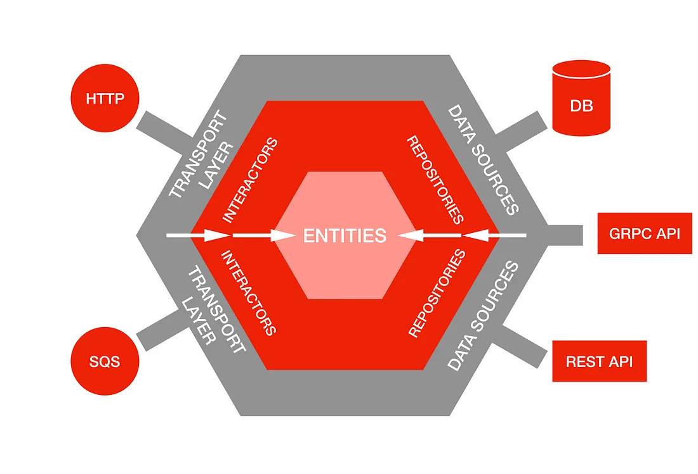

# GlobalWebIndex Engineering Challenge

This is implementation of assignment prepared for interview purposes.

---

### About the implementation

This project implements simple API for assets management and fulfills requirements provided in task description.
The structure of an application is based on a hexagonal architecture approach, which brings separation of layers and
interchangeability of components. For easier understanding, please check the diagram below.



The goals of hexagonal architecture was implemented with usage of interfaces and proper directory structure.
Explanation of directory structure and organisation of a code:

```
├── assets                  -> main directory of the project
│   ├── assets                -> general purpose files, i.e. scripts, deployments, etc. 
│   ├── cfg                   -> default configuration of the service
│   ├── cmd                   -> entry point of an app - main.go file
│   ├── internal              -> actual implementation of the service
│   │   ├── core              -> contains all core code of the program
│   │   │   ├── domain        -> busines logic of an app, i.e. data models, validation
│   │   │   ├── interactors   -> code that connects all the operations like fetching/saving data to prepare final result
│   │   │   ├── ports         -> interfaces that describes app layers, i.e. interactors, repositories
│   │   ├── handlers          -> code reponsible for exposing business logic to outside world (http endpoints)
│   │   ├── repositories      -> code reponsible for sending/pulling data from external sources, i.e. databases, apis
│   ├── pkg                   -> reusable utility functions/libraries
│   ├── config.yaml           -> actual config loaded by a program
└── ... other files
```

#### Design and Assumptions

This demo project is designed to be used through REST API. Main goal of presented approach is to provide high availability,
so CassandraDB was selected as database to storing assets, users and favourites. All listing requests are paginated, cursor approach
has been applied, so once we get limited amount of data and there is more, the cursor will be returned. It can be used in next
request to continue listing from previous point. If all data has been fetched already, empty cursor will be returned.

Database design was designed to be efficient and extensive. There is main table for general assets which references specific
tables like charts, insights and audiences. While fetching given asset all dependent data are being populated automatically.
Internal implementation of the API is optimized for handling multiple objects in one request, multi-threading also has been applied
to parallelize fetching some data.

##### Notes and observations:
- user authentication was simplified for purpose of this demo and is not meant to be used in production environment
- to simplify configuration and initial setup secret for auth purposes has been placed in config file. In real world scenario it shouldn't be stored in repository, but in safe space i.e. kubernetes secret.
- due to limited time only basic tests for each interactor were implemented. In real world project test coverage should be as high as possible.
- as this is only the demo, all requests are public and available for everyone and there is not permission system. In real world application it would need to be secured so user would be authorized for every request.
- after starting the application, you need to wait for cassandra db to fully start. You can see connection error a few times in a console while database is starting but you can ignore it - it will retry a connection multiple times, so once database is ready you should be able to notice welcome Echo HTTP server logs
---

### Running application

command to start server with database:

```bash 
make start
```

command to run all tests in the project:

```bash 
make test
```

command top stop server and clean resources:
```bash 
make stop
```

---

### Local environment

For comfortable and robust development, local environment setup is attached to the project.
It's based on tilt.dev utility tool and requires local Kubernetes Cluster. Currently, it works only on MacOS and Docker
Desktop Kubernetes Cluster. It can be extended for different operating systems and cluster providers i.e. MicroK8s or
Minicube, however this is out of the scope following project.

With local environment turned on its easy to test application - it supports hot restarts after pressing `CMD+S`.
Under the hood it triggers recompilation of an app locally and then injects a new binary to the docker container, so
you don't need to wait for rebuilding entire container. It also can be extended to handle multiple micro-services and
other software i.e. Redis, Firebase Auth emulator.

command to initiate local env:
```bash
make init-local-env
```

command to start local env:
```bash
make start-local-env
```

command to stop local env:
```bash
make stop-local-env
```

To reach service after local env is ready, you can use same CURL examples as before, but you need to replace
`localhost:8080` with just a `localhost`, request will be routed to the service through ingress.


---

# Api Usage Examples

### Register User

POST http://localhost:8080/api/users/register

Body:
```json
{
    "email": "test@test.com",
    "password": "test1234"
}
```

Response:

```json
{
    "email": "test@test.com",
    "password": "<top secret>",
    "id": "2ebdbaa3-8947-42f0-9482-e20e72506bb8",
    "create_time": "2023-06-27T20:17:46.623Z",
    "update_time": "2023-06-27T20:17:46.624Z"
}
```

### Login User

POST http://localhost:8080/api/users/login

BODY:
```json
{
    "email": "test@test.com",
    "password": "test1234"
}
```

Response:

```json
{
    "email": "test@test.com",
    "password": "<top secret>",
    "id": "2ebdbaa3-8947-42f0-9482-e20e72506bb8",
    "create_time": "2023-06-27T20:17:46.623Z",
    "update_time": "2023-06-27T20:17:46.624Z"
}
```

### Create Asset (Chart)

POST http://localhost:8080/api/assets/create

BODY:
```json
{
  "type": "CHART",
  "name": "Important Chart",
  "description": "this is very important chart",
  "asset_data": {
    "chart": {
      "title": "weather chart",
      "x_axis_title": "temperature",
      "y_axis_title": "humidity",
      "data": [
        {"x": 1, "y": 2},
        {"x": 2, "y": 3},
        {"x": 3, "y": 4}
      ]
    }
  }
}
```

Response:

```json
{
  "content_id": "2e93fe4d-a740-4dea-a0e4-aa9716b46e61",
  "type": "CHART",
  "name": "Important Chart",
  "description": "this is very important chart",
  "asset_data": {
    "chart": {
      "title": "weather chart",
      "x_axis_title": "temperature",
      "y_axis_title": "humidity",
      "data": "[{\"x\":1,\"y\":2},{\"x\":2,\"y\":3},{\"x\":3,\"y\":4}]",
      "id": "2e93fe4d-a740-4dea-a0e4-aa9716b46e61",
      "create_time": "2023-06-27T21:40:09.104Z",
      "update_time": "2023-06-27T21:40:09.107Z"
    }
  },
  "id": "41c8a41f-812a-452e-8559-0d0d440a6c65",
  "create_time": "2023-06-27T21:40:09.111731923Z",
  "update_time": "2023-06-27T21:40:09.111934339Z"
}
```

### Create Asset (Insight)

POST http://localhost:8080/api/assets/create

BODY:
```json
{
  "type": "INSIGHT",
  "name": "Important Insight",
  "description": "this is very important insight",
  "asset_data": {
    "insight": {
      "text": "lorem ipsum..."
    }
  }
}
```

Response:

```json
{
  "content_id": "b1568ac7-270d-452a-9bb7-a580e8c3dadf",
  "type": "INSIGHT",
  "name": "Important Insight",
  "description": "this is very important insight",
  "asset_data": {
    "insight": {
      "text": "lorem ipsum...",
      "id": "b1568ac7-270d-452a-9bb7-a580e8c3dadf",
      "create_time": "2023-06-27T21:43:53.374Z",
      "update_time": "2023-06-27T21:43:53.374Z"
    }
  },
  "id": "8bb8d4fc-60a1-47d7-b91c-84aee9912022",
  "create_time": "2023-06-27T21:43:53.390925763Z",
  "update_time": "2023-06-27T21:43:53.391027388Z"
}
```

### Create Asset (Audience)

POST http://localhost:8080/api/assets/create

BODY:
```json
{
  "type": "AUDIENCE",
  "name": "Important Audience",
  "description": "this is very important audience",
  "asset_data": {
    "audience": {
      "gender": "FEMALE",
      "birth_country": "Greece",
      "age_group": "18-23",
      "social_media_hours": 3,
      "purchases_last_month": 10
    }
  }
}
```

Response:

```json
{
  "content_id": "ecf694b8-0b20-4ec3-9564-ab89bfc84e2b",
  "type": "AUDIENCE",
  "name": "Important Audience",
  "description": "this is very important audience",
  "asset_data": {
    "audience": {
      "gender": "FEMALE",
      "birth_country": "Greece",
      "age_group": "18-23",
      "social_media_hours": 3,
      "purchases_last_month": 10,
      "id": "ecf694b8-0b20-4ec3-9564-ab89bfc84e2b",
      "create_time": "2023-06-27T21:46:55.567Z",
      "update_time": "2023-06-27T21:46:55.569Z"
    }
  },
  "id": "cbd1feb4-17a5-4806-8ded-c74fb1ffca8b",
  "create_time": "2023-06-27T21:46:55.576207458Z",
  "update_time": "2023-06-27T21:46:55.576286583Z"
}
```

### Get Specific Asset

GET http://localhost:8080/api/assets/ecf694b8-0b20-4ec3-9564-ab89bfc84e2b

Response:

```json
{
    "content_id": "ecf694b8-0b20-4ec3-9564-ab89bfc84e2b",
    "type": "AUDIENCE",
    "name": "Important Audience",
    "description": "this is very important audience",
    "asset_data": {
        "audience": {
            "gender": "FEMALE",
            "birth_country": "Greece",
            "age_group": "18-23",
            "social_media_hours": 3,
            "purchases_last_month": 10,
            "id": "ecf694b8-0b20-4ec3-9564-ab89bfc84e2b",
            "create_time": "2023-06-27T21:46:55.567Z",
            "update_time": "2023-06-27T21:46:55.569Z"
        }
    },
    "id": "cbd1feb4-17a5-4806-8ded-c74fb1ffca8b",
    "create_time": "2023-06-27T21:46:55.576Z",
    "update_time": "2023-06-27T21:46:55.576Z"
}
```

### List Assets (paginated)

GET http://localhost:8080/api/assets?limit=2&cursor=JGE4OGE0YzkxLTJkZWItNDA5NC1hY2VhLTkxYjhjNWUxZTdmNgDwf____QA=

Response:

```json
{
  "assets": [
    {
      "content_id": "f61a6a7a-682c-40b9-b2e6-46c18ae703df",
      "type": "INSIGHT",
      "name": "Important Insight",
      "description": "this is very important insight",
      "asset_data": {
        "insight": {
          "text": "lorem ipsum...",
          "id": "f61a6a7a-682c-40b9-b2e6-46c18ae703df",
          "create_time": "2023-06-27T22:05:07.001Z",
          "update_time": "2023-06-27T22:05:07.001Z"
        }
      },
      "id": "d116c061-7ba4-46e8-b967-9fbcf35be506",
      "create_time": "2023-06-27T22:05:07.005Z",
      "update_time": "2023-06-27T22:05:07.005Z"
    }
  ],
  "cursor": ""
}
```

### Update Asset (description)

PATCH http://localhost:8080/api/assets/update

Body:

```json
{
    "id": "d116c061-7ba4-46e8-b967-9fbcf35be506",
    "description": "not that important insight"
}
```

Response:

```json
{
  "content_id": "f61a6a7a-682c-40b9-b2e6-46c18ae703df",
  "type": "INSIGHT",
  "name": "Important Insight",
  "description": "not that important insight",
  "asset_data": {
    "insight": {
      "text": "lorem ipsum...",
      "id": "f61a6a7a-682c-40b9-b2e6-46c18ae703df",
      "create_time": "2023-06-27T22:05:07.001Z",
      "update_time": "2023-06-27T22:05:07.001Z"
    }
  },
  "id": "d116c061-7ba4-46e8-b967-9fbcf35be506",
  "create_time": "2023-06-27T22:05:07.005Z",
  "update_time": "2023-06-27T22:08:14.180699717Z"
}
```

### Delete Asset

DELETE http://localhost:8080/api/assets/delete/028065d3-e87a-4c7d-98e9-130794a9347a

Response:

```json
{
  "content_id": "9b771506-eebd-491a-a486-92d5625f9d88",
  "type": "CHART",
  "name": "Important Chart",
  "description": "this is very important chart",
  "asset_data": {
    "chart": {
      "title": "weather chart",
      "x_axis_title": "temperature",
      "y_axis_title": "humidity",
      "data": "[{\"x\":1,\"y\":2},{\"x\":2,\"y\":3},{\"x\":3,\"y\":4}]",
      "id": "9b771506-eebd-491a-a486-92d5625f9d88",
      "create_time": "2023-06-27T22:17:45.174Z",
      "update_time": "2023-06-27T22:17:45.176Z"
    }
  },
  "id": "028065d3-e87a-4c7d-98e9-130794a9347a",
  "create_time": "2023-06-27T22:17:45.179Z",
  "update_time": "2023-06-27T22:19:16.426261468Z"
}
```

### Add Favourite

POST http://localhost:8080/api/favourites/add

BODY:
```json
{
  "user_id": "2ebdbaa3-8947-42f0-9482-e20e72506bb8",
  "asset_id": "6abd973e-0330-4fa5-a4a4-2dc6c758e0ee"
}
```

Response:

```json
{
  "user_id": "2ebdbaa3-8947-42f0-9482-e20e72506bb8",
  "asset_id": "6abd973e-0330-4fa5-a4a4-2dc6c758e0ee",
  "id": "1901b150-1b02-474a-8de3-610f31597fa6",
  "create_time": "2023-06-27T22:40:16.341375926Z",
  "update_time": "2023-06-27T22:40:16.342609634Z"
}
```

### Get Specific Favourite

GET http://localhost:8080/api/favourites/1901b150-1b02-474a-8de3-610f31597fa6

Response:

```json
{
  "user_id": "2ebdbaa3-8947-42f0-9482-e20e72506bb8",
  "asset_id": "6abd973e-0330-4fa5-a4a4-2dc6c758e0ee",
  "id": "1901b150-1b02-474a-8de3-610f31597fa6",
  "create_time": "2023-06-27T22:40:16.341Z",
  "update_time": "2023-06-27T22:40:16.342Z"
}
```

### List User's Favourites (paginated)

GET http://localhost:8080/api/favourites/user/2ebdbaa3-8947-42f0-9482-e20e72506bb8?limit=2&cursor=JGZhZmUxM2FiLTY1MTktNGMxMC04ZGU2LTc3NTYyOGQxYTcyOQDwf____QA=

Response:

```json
{
  "cursor": "",
  "favourites": [
    {
      "user_id": "2ebdbaa3-8947-42f0-9482-e20e72506bb8",
      "asset_id": "66cf8e07-5f94-4e95-b73e-2b87a2e39a2c",
      "id": "71b5c61a-d671-46d9-b758-33e1cdab1a49",
      "create_time": "2023-06-27T22:57:33.521Z",
      "update_time": "2023-06-27T22:57:33.522Z"
    }
  ]
}
```

### Delete Favourite

DELETE http://localhost:8080/api/favourites/delete/ad1d9a6a-a429-49bc-862b-8dc1e3a33fcb

Response:

```json
{
  "user_id": "2ebdbaa3-8947-42f0-9482-e20e72506bb8",
  "asset_id": "66cf8e07-5f94-4e95-b73e-2b87a2e39a2c",
  "id": "ad1d9a6a-a429-49bc-862b-8dc1e3a33fcb",
  "create_time": "2023-06-27T22:42:17.528Z",
  "update_time": "2023-06-27T22:44:22.020023429Z"
}
```